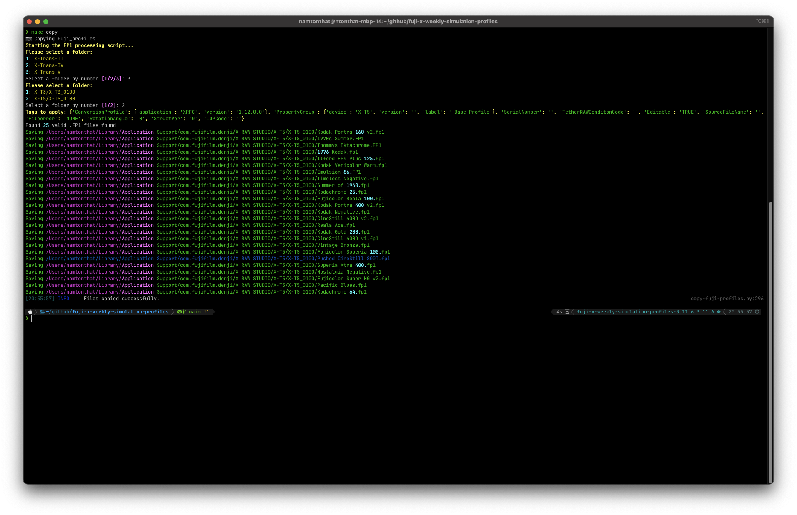
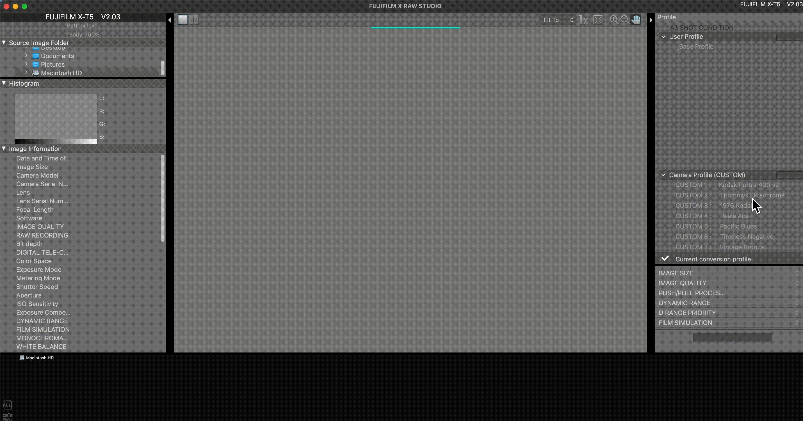

# fuji-x-weekly-simulation-profiles

**Built with**

[](https://github.com/astral-sh/ruff)
[](https://www.python.org)

**Repo Status**

[](https://github.com/namtonthat/fuji-x-weekly-simulation-profiles/actions/workflows/on-fornightly-scrape.yml?query=branch%3Amain)
[](https://img.shields.io/github/license/namtonthat/fuji-x-weekly-simulation-profiles)

### Purpose

- Auto scraping the [www.fujixweekly.com](https://www.fujixweekly.com) for `Fuji X` simulation profiles every fornight
- A simple CLI tool to copy the `.FP1` files over to `X Raw Studio` app with ease using CLI and Python (works for mac OS).
  

### Getting Started

```
# Setting up your environment
make install
```

### Installing Profiles to `FujiX` App

1. Make a blank profile; this is so that the serial number is registered and can be copied over with the template `.fp1` file.

   a. Open `Fujifilm X Raw Studio` App.

   b. Create a base profile named `_Base Profile` so it appears first. (It doesn't have to, I've just done it for convenience)

2. Run

```
# Copy the files from fuji_profiles into your local environment
make copy
```



- This will start the CLI command prompt to copy the `FujiProfiles` over to your computer.

### Reingestion

In the case that the profiles aren't being parsed correctly, you can force a reingestion by running `make clean` which removes the `./cached` profiles. This is automated to run every fortnight.

```
# To force a reingestion, run
make clean
```

## Motivations

- [plamf repo](https://github.com/plamf/fuji-x-weekly-simulation-profiles)
- Repository initiated with [fpgmaas/cookiecutter-uv](https://github.com/fpgmaas/cookiecutter-uv).
